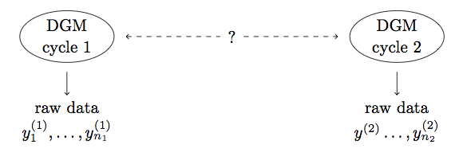

```{r set_params, echo=FALSE}
n.subset <- 1000  ## n = 52397
coefParts <- 25
```

In this `R` notebook, we describe and implement some statistical methods to handle prediction scoring.  In the NGS2 program, we see this methodology as helping ETE teams to compare predictions to observed results from the experiments in each cycle.  For example, we might be interested in comparing:

* predictions or hypotheses from *preregistration materials* to *observed experimental data*
* predictions based on *observed cycle one data* to *observed experimental data from cycle two*

We have packaged this methodology as an easy to use function in `R` and can see this type of analysis being beneficial to a variety of researchers, outside of the NGS2 program.  For example, any researchers interested in evaluating pre-registered hypotheses or any researchers working with experimental data that is collected in cycles or stages, may find this discussion helpful.

## Getting started

This notebook uses the following `R` packages:

* [rstan](https://cran.r-project.org/web/packages/rstan/index.html) and [rstanarm](https://cran.r-project.org/web/packages/rstanarm/index.html) to interface with `Stan` to fit Bayesian models,
* [class](https://cran.rstudio.com/web/packages/class/index.html) for performing k-nearest neighbors classification,
* [ggplot2](https://cran.r-project.org/web/packages/ggplot2/index.html) for plotting,
* as well as [png](https://cran.r-project.org/web/packages/png/index.html) and [grid](https://cran.r-project.org/web/packages/grid/index.html) to include figures in this notebook.

and was built using `R` *version 3.4.0.*  Please be sure that all packages (and dependencies) listed above are installed and that the version of `R` on your machine is up to date.

```{r load_libs, include=FALSE}
library(rstan)
library(rstanarm)
library(class)
library(ggplot2)

library(png)
library(grid)
```

## A general framework
Here, we will be interested in the setting where experiments are conducted in two cycles or stages (of course, we could easily extend this to multiple cycles) and our focus will be to provide statistical tools which help to answer the following natural question:

> Is the data generating mechanism that operates in the first cycle the same as the data generating mechanism that operates in the second cycle?

```{r fig_dgm, fig.width=6, fig.height=2, echo=FALSE}
img <- readPNG("Flowchart/Images/TwoDGMs.png")
grid.raster(img)
```
<!--  -->

We will try to answer this question by using our modeling framework to help gauge observed variation across the cycles of the experiment.  If/when we observe differences in the $y$'s across the experiments

* are those differences large enough to suggest that the data generating mechanisms differ across the two cycles
* OR are those differences small enough that they could simply be due to inherit sampling variability (e.g. different subjects on a different day in a slightly different environment...)?

Our general idea is to compare predictions from our model (draws from the posterior predictive distribution, in a Bayesian setting) to observed experimental data from Cycle 2.  Unlike typical approaches (i.e. validation), our methodology emphasizes the importance of **calibrating** validation-style results (see the 'Prediction Scoring' section for more details).  We can think of our prediction scoring methodology (described in more detail below) simply as a function of experimental data from cycles one and two and the model fitting software.

```{r fig_idea, fig.width=6, fig.height=7, echo=FALSE}
img <- readPNG("Flowchart/Images/Idea.png")
grid.raster(img)
```

## Example data
To explain our prediction scoring methodology, we will illustrate these methods using blog post data collected in the early 2010s by @buza_2014 which is available in the UCI Machine Learning Repository, [here](https://archive.ics.uci.edu/ml/datasets/BlogFeedback#).

```{r load_data, include=FALSE}
blog.full <- read.csv("data/blogData_train.csv",
                 header=FALSE)
blog.test <- read.csv("data/blogData_test-2012.02.01.00_00.csv",
                 header=FALSE)

## Name the columns
att_names <- c( paste(rep(c("comm","links"),each=5),
                   c(".tot",".pre.1day",".pre.2day",
                    ".post.1day",".pre.vsday"), sep=""))
names(blog.full) <- c( paste(c("avg","sd","min","max","med"),
                        ".",rep(att_names,each=5),sep=""),
                  att_names,
                  "pubtime", "length", 
                  paste("bagwords",1:200,sep=""),
                  paste("basetime",c("Mo","Tu","We","Th","Fr","Sa","Su"),sep=""),
                  paste("pubtime",c("Mo","Tu","We","Th","Fr","Sa","Su"),sep=""),
                  "parents",
                  paste(c("min","max","avg"),".comm.parents",sep=""),
                  "comm.next24" )
names(blog.test) <- names(blog.full)

## Set sample size
n <- nrow(blog.full)
```

We will focus on the *prediction of the number of comments that a blog post receives in the upcoming 24 hours*.  In order to simulate this situation, @buza_2014 chooses a basetime (in the past) and considers blog posts that were published at most 72 hours before the selected base/time.  The dataset was then created by processing the raw HTML-documents of blog posts with basetimes in the years 2010 and 2011.  See @buza_2014 for more details.

The training data contains information about

* `r n` blog posts,
* that each contain `r round(mean(blog.full$length),2)` words on average,
* that each have `r round(mean(blog.full$comm.tot),2)` total comments (prior to baseline) on average with a median of `r median(blog.full$comm.tot)` comments
* and that each get `r round(mean(blog.full$comm.next24),2)` comments in the next 24 hours on average, with a median of `r median(blog.full$comm.next24)` comments.

As we might expect, the distributions for total comments (prior to baseline) and for comments in the next 24 hours are heavily right-skewed.  The dataset also contains information about the number of comments in the 24-hour period preceding the baseline time, frequent words used in the blog posts, and information about the distribution of comments posted to the source of the blog post (e.g. myblog.blog.org would be the source of the post myblog.blog.org/post_2010_09_10).

The author also provides multiple testing datasets - here, we restrict our attention a single testing set as this setting more closely corresponds to typical practice.

## A simple model
In each of the examples below, we consider two simple models - linear regression and k-nearest neighbors.  In the following examples, we will consider this linear regression model from the traditional frequentist viewpoint, as well as within a Bayesian framework.

```{r prep_run_models, echo=FALSE}
## For demonstration purposes, use a subset of the full dataset
if (is.na(n.subset)){ blog <- blog.full 
} else { blog <- blog.full[sample.int(n,n.subset),] }
```

```{r run_models, results='hide', message=FALSE, warning=FALSE, error=FALSE}
## Regression models
modelTerms <- c("comm.pre.1day","links.pre.1day",
                 "avg.comm.pre.1day", "avg.links.pre.1day",
                 "sd.comm.pre.1day", "sd.links.pre.1day",
                 "pubtime", "length", "parents")
```

```{r run_models_mid, echo=FALSE}
## Check for variation across observations
if (sum(sapply(blog[,modelTerms],sd)==0)>0){
  print(paste("Error:",names(which(sapply(blog[,modelTerms],sd)==0)),
              "has no observed variation in the training set.")) }
if (sum(sapply(blog.test[,modelTerms],sd)==0)>0){
  print(paste("Error:",names(which(sapply(blog.test[,modelTerms],sd)==0)),
              "has no observed variation in the testing set.")) }
```

```{r run_models2, results='hide', message=FALSE, warning=FALSE, error=FALSE}
modelFormula <- as.formula(paste("comm.next24 ~",
                  paste(modelTerms,collapse="+")))

bayesReg <- stan_lm( modelFormula,
               data=blog, prior=NULL,
               chains=1, show_messages=FALSE )
freqReg <- lm( modelFormula, data=blog )

## k-nearest neighbors
classCuts <- c(-1,0,1,10,25,100,max(blog$comm.next24))
blog.class <- cut(blog$comm.next24, classCuts)
test.class <- cut(blog.test$comm.next24, classCuts)

machKnn <- knn( blog, blog.test, blog.class,
                k=length(classCuts)-1, prob=TRUE )
```

## Validation and cross-validation
We can think of the prediction scoring framework as a form of *validation*, if we simply treat the Cycle 1 experiment as a training set and the Cycle 2 experiment as a testing set.  Traditionally, model validation is used to assess the predictive ability of the model.  Of course, in our prediction scoring framework, we are less interested in the fit of the model itself and more interested in learning about potential differences in the data generating mechanism(s) across the experimental cycles.

Naturally, model validation is closely tied to *cross-validation*.  In cross-validation, an existing dataset is partitioned into training and testing sets repeatedly (using different partitions) and validation results are combined over these rounds to estimate a final predictive model.

#### Leave-one-out cross validation
This popular version of cross validation partitions the data into $n$ subsets, so that the $i$th subset contains all but the $i$th observation (i.e., the $i$th observation is "left out").  

For each $k=1,\dots,n,$

```{r fig_crossVal, fig.width=3, fig.height=0.5, echo=FALSE}
img <- readPNG("Flowchart/Images/crossVal.png")
grid.raster(img)
```

and compare $y_k^{(2)}$ to $\hat{\mathbf{y}}_k^{(2)}$ by computing a quantile,
\[ q_k^{(1)} = \frac{1}{L} \sum_{l=1}^L I_{ \left\{ y_k^{(1)} > \hat{y}_{kl}^{(1)} \right\}  }. \]

That is, we fit the model to $\mathbf{y}_{-k}^{(1)}$, the original dataset with the $k$th observation removed, and then use $\mathbf{x}_k^{(1)}$, any covariates corresponding to the $k$th observation, and this fitted model to produce a vector of predictions for the $k$th observation, $\hat{\mathbf{y}}_k^{(1)}$.  If the model fits the data well, then the true value, $y_k^{(1)}$, should look like it belongs with this vector of predictions, $\hat{\mathbf{y}}_k^{(1)}$, and the $q_k^{(1)}$ should be uniformly distributed.

#### Validation
For each $k=1,\dots,n,$

```{r fig_val, fig.width=3, fig.height=0.5, echo=FALSE}
img <- readPNG("Flowchart/Images/val.png")
grid.raster(img)
```

and compare $y_k^{(1)}$ to $\hat{\mathbf{y}}_k^{(1)}$ by computing a quantile,
\[ q_k^{(2)} = \frac{1}{L} \sum_{l=1}^L I_{ \left\{ y_k^{(2)} > \hat{y}_{kl}^{(2)} \right\}  }. \]

That is, we fit the model to $\mathbf{y}^{(1)}$, the full cycle one dataset, and then use $\mathbf{x}_k^{(2)}$, any covariates corresponding to the $k$th observation from cycle two, and this fitted model to produce a vector of predictions for the $k$th observation in cycle two, $\mathbf{\hat{y}}_k^{(2)}$.  If the model fits the data well, then the true value, $y_k^{(2)}$, should look like it belongs with this vector of predictions, $\hat{\mathbf{y}}_k^{(2)}$, and the $q_k^{(2)}$ should be uniformly distributed.

## Prediction Scoring
It may be tempting to stop here and treat the set of $q_k^{(2)}$'s as prediction scores, by considering how closely they follow the uniform distribution, for example, or by deriving a more nuanced test statistic from this set of measures.  However, any tests about the $q_k^{(2)}$'s include the assumption that our model is correct.  Indications from the $q_k^{(2)}$'s alone that the data generating mechanism varies across the two cycles could simply be due to an inadequate model.

Instead, we recommend comparing the $q_k^{(2)}$'s to the $q_k^{(1)}$'s.  Because both sets of quantiles are based on the same model, comparisons across these vectors should be less sensitive to poor modelling choices.

```{r fig_predScore, fig.width=6, fig.height=8, echo=FALSE}
img <- readPNG("Flowchart/Images/predScore.png")
grid.raster(img)
```

```{r load_fcn, echo=FALSE}
source("PredScore.R")
```

### Predictions for outcome variables

```{r out_bayes_reg, results='hide', message=FALSE, warning=FALSE, error=FALSE}
q_cv <- predscore(blog,bayesReg)
q_cyc <- predscore(blog,bayesReg,blog.test)
```

Below, we plot histograms of the $q$'s, or posterior quantiles.  Following @cook_gelman_rubin_2006,, we also consider
\[ x_i = \Phi^{-1}(q_i)\]
where $\Phi$ is the standard normal cdf.  If the posterior quantiles are uniformly distributed, then the $x_i$'s should be distributed according to a standard normal distribution.
```{r, echo=FALSE, fig.height=3, fig.width=8}
par(mfrow=c(1,3))
hist(q_cv$q, breaks=25, main="Cycle 1 Cross Validation", xlab="")
hist(q_cyc$q, breaks=25, main="Across Cycle Validation", xlab="")
plot(ecdf(q_cv$q),main="Empirical CDFs",xlab="q",ylab="Fn(q)",do.points=FALSE,verticals=TRUE)
plot(ecdf(q_cyc$q),col="blue",do.points=FALSE,verticals=TRUE,add=TRUE)
plot(ecdf(runif(1000)),col="red",do.points=FALSE,verticals=TRUE,add=TRUE)
legend("topleft",c("cross-validation","validation","uniform"),
       col=c("black","blue","red"), lty=1)

x_cv <- qnorm(q_cv$q); x_cyc <- qnorm(q_cyc$q)
x_cv[x_cv==-Inf] <- NA; x_cv[x_cv==Inf] <- NA
x_cyc[x_cyc==-Inf] <- NA; x_cyc[x_cyc==Inf] <- NA

qqnorm(x_cv, main="Cycle 1 Cross Validation"); qqline(x_cv,col="red")
legend("topleft","Normal pdf",lty=1,col="red",cex=.8)
qqnorm(x_cyc, main="Across Cycle Validation"); qqline(x_cyc,col="red")
plot(ecdf(x_cv),main="Empirical CDFs",do.points=FALSE,verticals=TRUE)
plot(ecdf(x_cyc),col="blue",do.points=FALSE,verticals=TRUE,add=TRUE)
plot(ecdf(rnorm(1000)),col="red",do.points=FALSE,verticals=TRUE,add=TRUE)
legend("topleft",c("cross-validation","validation","normal"),
       col=c("black","blue","red"), lty=1)
```
To further test for model fit, we can calculate
\[ X^2 = \sum_{i=1}^{N_{rep}} (\Phi^{-1}(q_i))^2 \]
which should follw a $\chi^2$ distribution with $N_rep$ degrees of freedom.

```{r chisq}
Xsq_cv <- sum(x_cv^2,na.rm=TRUE)
Xsq_cyc <- sum(x_cyc^2,na.rm=TRUE)

pval_cv <- 1-pchisq(Xsq_cv,nrow(blog))
pval_cyc <- 1-pchisq(Xsq_cyc,nrow(blog.test))

pval_cv
pval_cyc
```
```{r write_chisq, echo=FALSE}
chiSmall <- (pval_cv+pval_cyc<.1)
```

Since these p-values `r ifelse(chiSmall,"are small","are not very small")`, we `r ifelse(chiSmall,"can reject","fail to reject")` the null hypothesis that the $q_i$'s are uniformly distributed.  This is an indication that the modelling choices `r ifelse(chiSmall,"should be reconsidered","are not unreasonable")`.

To compare the posterior quantiles and actually address prediction scoring, we can compute a two-sample Kolmogorov-Smirnov test statistic:
\[ D_{n_1,n_2} = \sup_{q} \left| F_{n_1}^{(1)}(q) - F_{n_2}^{(2)}(q)  \right| \]
where $F_{n_1}^{(1)}(q)$ is the empirical distribution function for the posterior quantiles of the cycle one cross-validation, based on $n_1$ samples, and $F_{n_2}^{(2)}(q)$ is the empirical distribution function for the posterior quantiles of the across-cycle validation, based on $n_2$ samples from cycle two.  Generically, we compute an empirical distribution function, $F_n$ for $n$ iid observations, $X_i$, as
\[ F_n(x) = \frac{1}{n} \sum_{i=1}^n I_{[-\infty,x]}(X_i).\]

We can reject the null hypothesis that the two samples come from a common distribution at level $\alpha$ if
\[ D_{n_1,n_2} > \sqrt{ \frac{ n_1 + n_2}{n_1n_2} \left[ -\frac{1}{2} \text{log}\left( \frac{\alpha}{2} \right) \right] }.\]

```{r ks_test, warning=FALSE, message=FALSE}
ks.test(q_cv$q,q_cyc$q)
```

```{r write_ks_test, echo=FALSE}
ksSmall <- (ks.test(q_cv$q,q_cyc$q)$p.value<.05)
```

Since this p-value `r ifelse(ksSmall,"is small","is not very small")`, we `r ifelse(ksSmall,"can reject","fail to reject")` the null hypothesis that the $q_i$'s come from a common distribution.  This is an indication that the data generating process most likely `r ifelse(ksSmall,"differs","does not differ")` across the experimental cycles.

#### k-fold version

Rather than using leave-one-out cross validation, we might consider cutting the computation time involved by using k-fold cross validation:
```{r out_bayes_reg_k, results='hide', message=FALSE, warning=FALSE, error=FALSE}
q_cv_k <- predscore(blog,bayesReg,partitions=10)
plot.predscore(q_cv_k$q)
```

We can then compare this to the validation results computed previously:
```{r ks_test_kfold, warning=FALSE, message=FALSE}
ks.test(q_cv_k$q,q_cyc$q)
```

```{r write_ks_test_kfold, echo=FALSE, fig.width=5}
ksSmall.kfold <- (ks.test(q_cv_k$q,q_cyc$q)$p.value<.05)
```

Since this p-value `r ifelse(ksSmall.kfold,"is small","is not very small")`, we `r ifelse(ksSmall.kfold,"can reject","fail to reject")` the null hypothesis that the $q_i$'s come from a common distribution.  This is an indication that the data generating process most likely `r ifelse(ksSmall.kfold,"differs","does not differ")` across the experimental cycles.

### Predictions for model parameters
Note that when we were making predictions for the outcome variables, there is a clear connection to the *true* observation:

* In cross-validation, we have access to the truth.  For example, in leave-one-out cross validation, the observation left out is the true observation which we're trying to predict, based on all other data points.
* In validation, we treat the cycle two observation as the truth, which we are trying to predict based on cycle one observations.

In both cases, the true observation is a single number.  When we move to the case where we are interested in making predictions for model parameters, it is more natural (particulary, in a Bayesian setting) to think of the truth as a distribution - the marginal posterior distributions for the model parameter(s) of interest.  Thus, when making predictions for model parameters,

* In cross validation, we will compare (samples from) the posterior distribution for the parameters based on the $k$th subset of the data to (samples from) the posterior distribution for the parameters based on the remaining data points.
* In validation, we will compare (samples from) the posterior distribution based on cycle one data to (samples from) the posterior distribution based on cycle two data.

Because we are now making comparisons across (samples from) two distributions (rather than comparing a single true observation to a distribution, as before), using quantiles no longer makes sense.  Instead, we will use a Kolmogorov-Smirnov test to test whether the samples come from a single distribution.

Finally, to score these predictions, we can compare the K-S test statistic from the validation procedure to those obtained from the cross-validation routine:

```{r pre_coef_bayes_reg}
coefParts
```

```{r coef_bayes_reg, results='hide', message=FALSE, warning=FALSE, error=FALSE}
paramList <- c("pubtime","length")
q_cv_coef <- predscore(blog,bayesReg,params=paramList,partitions=coefParts)
q_cyc_coef <- predscore(blog,bayesReg,blog.test,params=paramList)

par(mfrow=c(length(paramList),2))
for (i in 1:length(paramList)){
  hist(q_cv_coef$results[,i], xlab="KS statistic",
       xlim=range(c(q_cv_coef$results[,i],q_cyc_coef$ks.stat[i])),
       main=paramList[i], breaks=25)
  abline(v=q_cyc_coef$ks.stat[i],col="red")
  hist(q_cv_coef$pvalues[,i],  xlab="KS p-value",
       xlim=range(c(q_cv_coef$results[,i],q_cyc_coef$p.value[i])),
       main=paramList[i],breaks=25)
  abline(v=q_cyc_coef$p.value[i],col="red")
}
```

Since the validation K-S statistics look much larger than the set of cross-validation K-S statistics, we have some evidence that the data generating process may differ across the two cycles.  That is, the difference between the marginal posterior distributions for the model parameters that we observe between cycle one and cycle two data is outside of our expectation for the difference, based on differences across marginal posterior distributions obtained using cross-validation.

### Non-Bayesian models
We can also extend this approach to non-Bayesian models - for example, frequentist linear regression or k-nearest neighbors - by using bootstrapping to replace the posterior distributions discussed above.

#### Linear regression
Consider the cross-validation setting explained above.  In the Bayesian framework, we compare the truth, $y_k$, to $r$ samples from the posterior predictive distribution based on $y_{k-1}, x_{k-1}$.  In a non-Bayesian setting we replace these samples from the posterior predictive distribution with predictions based on $r$ bootstrapped datasets.

As discussed above, we might be interested in comparing predictions at the outcome-level or for model parameters.  In either case, we use bootstrapping to replace the posterior distributions that we relied on in previous versions of our prediction scoring routine.

```{r out_freq_reg, results='hide', message=FALSE, warning=FALSE, error=FALSE}
q_freq_cv <- predscore.nonBayes(blog,freqReg,partitions=10)
q_freq_cyc <- predscore.nonBayes(blog,freqReg,blog.test,partitions=10)

plot.predscore(q_freq_cv$q,q_freq_cyc$q)
```


## References